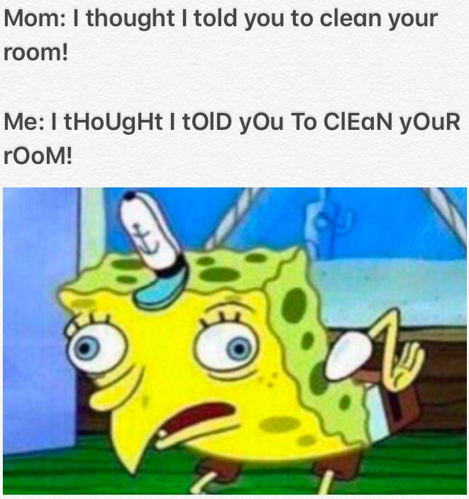

# Tutorial 7 Notes

* RECORD
* Today we will cover characters and strings + more input/output

<br>

---

## Assignment 1

Well done everyone for such a great effort in the first assignment.

Take a moment to think about how you found the assignment, and what you learned in the process of working on it.

If you could go back in time to the very start of the assignment, and give one piece of advice to your past self, what would you say?

Your tutor will talk about how you will get feedback from the marking of assignment 1.

<br>

---

## Q2 - Characters

So far in this course we have learnt about two data types - int and double. What about a char variable? What is the size of this variable, and what possible values can it have? What do these values mean? How do we declare one?

<details>

<summary>Answer</summary>

A char variable in C is 8 bits or 1 byte long. It's possible values are either -128 to 127 or 0 to 255. This depends on the compiler and computer achitecture being used. You can not guarantee that a char can store negative values such as EOF. The value a char holds usually represents a character on the ASCII table.

</details>

<br>

---

## Q3 - How do we use getchar and putchar? How does getchar signal to us that it has reached the end of the input?

```c
    int ch = getchar();
    putchar(ch);
```

<details>
<summary>Answer</summary>

Look at the man pages!

</details>

<br>

---

## Q4 - Why does getchar return an int instead of a char?

<details>
<summary>Answer</summary>

Getchar needs to tell us when the input has ended (When control-D is pressed) so it returns -1 when that happens. Depending on the implementation of the system a char may not allow negative values, so instead we just use ints.

</details>

<br>

---

## Q5 - is_upper.c

Write a function with prototype `int isUpper(char ch)` that returns true if the character given is upper case and false otherwise.

<br>

---

## Q6 - filter_upper.c

Write a program that removes all upper case letters from input and prints it out. Use is_upper.c and `getchar()` and `putchar()` until EOF.

```c 
    $ ./filter_upper
    abcDEFghi
    abcghi
```

<br>

---

## Q7 - sum_digits.c

Write a program sum_digits.c which reads characters from its input. When the end of input is reached it should print a count of the number of digits in its input and their sum.

```sh
    $ ./sum_digits
    1 2 3 o'clock
    4 o'clock rock

    Input contained 4 digits which summed to 10
    $ ./sum_digits
    12 twelve 24 twenty four
    thirty six 36

    Input contained 6 digits which summed to 18
```

<br>

---

## Q8 - What is a string?

How do we declare a string?

<details>
<summary>
Answer
</summary>

A string is an array of char variables, with a terminating null character. A string can be used to hold multiple char variables (like a word or sentence).

</details>  

<br>

---

## Q9 - What does this code do?

```c
    int secret_function(char *word) {
        int i = 0;
        int result = 0;
        while (word[i] != '\0') {
            if(word[i] >= 'a' && word[i] <= 'z') {
                result++;
            }
            i++;
        }
        return result;
    }
```

Can you explain the stopping case in the while loop? Why does it work and what is the significance of the '\0'?

What does the char *word input mean? What's the relationship between an array and a pointer?

<details>
<sumary>Answer</summary>

It will return the number of lower case letters in a given word. Comparing the letters to 'a' and 'z' allows us to treat them like numbers, in essence saying: "All letters between 'a' and 'z' inclusive."

The stopping case is relying on a string (char * or char[]) being finished by a null terminator, which is what the character '\0' is. This means that no matter how long the array is, the loop will finish at the point of the word ending instead of the end of the array.

char *word means that the function takes in a pointer to a character as its input. A pointer is a variable which contains a memory address, but so is an array. This function in particular is expecting the character pointer to be telling us the address of the first character in an array of characters. Since this array of characters ends with a '\0', it is a string.

There are some subtle differences between arrays and pointers in C. A pointer can have an address directly assigned to it but an array can not. You can only directly assign values to elements inside an array. Also, the sizeof operator will return the size of the pointer itself for a pointer, while the sizeof operator will return the total size of the array for an array.

</details>

<br>

---

## Q10 - How do we use fgets? What are the inputs given to fgets? How does fgets signal to us that it has reached the end of the input?

<details>

<summary>Answer</summary>

We need to give fgets an array, length and stream. fgets will return NULL if it reaches the end of the input without scanning in any further characters.

</details>

<br>

---

## Q11 - When fgets scans in a line of text, will it include a '\n' at the end of the line?

<details>

<summary>Answer</summary>

fgets will place a '\n' provided there is a newline at the end of the line of characters in the input (if the user presses Enter) and there is enough space. fgets will always ensure that there is a '\0' at the end of the string. If the length of the input line is greater than the length given to fgets, it will read at most length - 1 characters from the input line (ensuring space for the '\0'). In this case, the rest of the input line, including the newline, will not be stored in the array. If the user doesn't press Enter and only presses CTRL+D, then fgets will not include a '\n' at the end of the string.

</details>

<br>

---

## Q12 - Write a program echo_twice.c which reads lines from its input and prints them twice.

```sh
    $ ./echo_twice
    My cat's breath smells like cat food.
    My cat's breath smells like cat food.
    My cat's breath smells like cat food.
    My eyes! The goggles do nothing!
    My eyes! The goggles do nothing!
    My eyes! The goggles do nothing!
```

<br>

---

## Q13 - What are command line arguments? How do we access them?


<details>

<summary>Answer</summary>

When running a program via the command line, the extra text we type after the name of the program will be passed to the program as strings.

argc is the argument count. It is the integer number of arguments passed to the program. argv is the argument vector. It is an array of strings where each string is one of the arguments.

</details>

<br>

---

## Q13 - spongebobify.c

Write a program that reads in a string from the user and spongebobifies it. hint: use fgets() . 



<br>

---